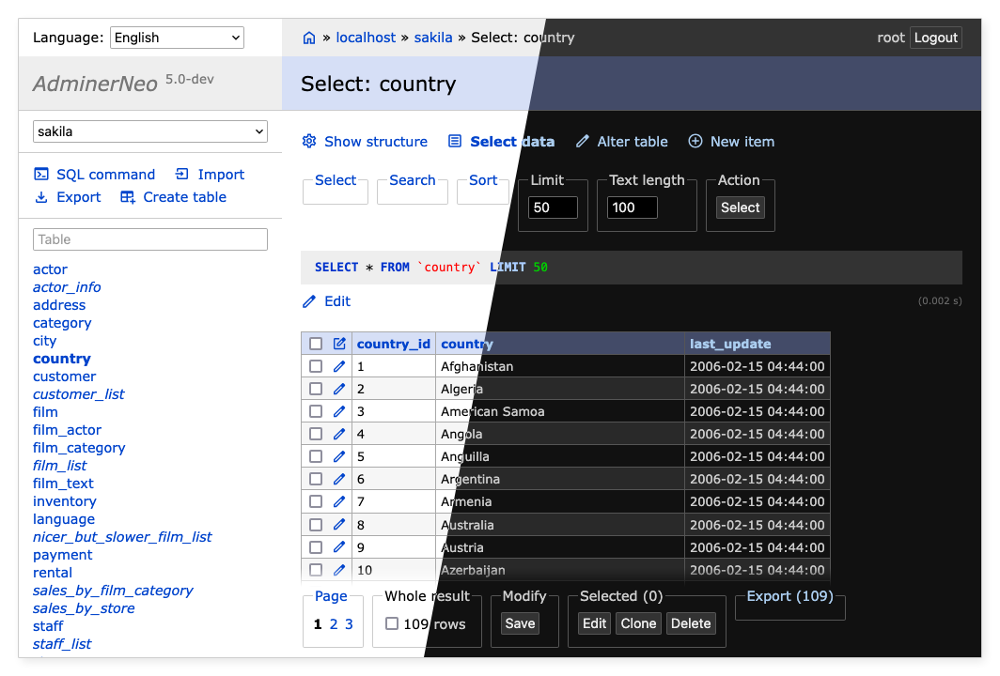

AdminNeo
==========

**AdminNeo** is a full-featured database management tool written in PHP. It consists of a single file ready to deploy 
to the target server. As a companion, **EditorNeo** offers data manipulation for end-users. 

Supported database drivers:
- MySQL, MariaDB, PostgreSQL, SQLite, MS SQL, Oracle, MongoDB
- With plugin: SimpleDB, Elasticsearch (beta), Firebird (alpha), ClickHouse (alpha)

AdminNeo is based on the [Adminer](https://www.adminer.org/) project by Jakub Vrána.



Requirements
------------

- PHP 5.6+ with enabled sessions.

Migration from Adminer
----------------------

- Remove plugin AdminerTablesFilter (plugins/tables-filter.php).
- If you use complex custom theme, you will probably need to adjust a thing or two.

More information can be found in [Upgrade Guide](docs/upgrade.md).

Please, read also 👉 **[What to expect](#what-to-expect)** section before you decide to switch to this project.

Usage
-----

Download one for the latest [release files](https://github.com/adminneo-org/adminneo/releases), upload to the HTTP server 
with PHP and enjoy 😉 If you are not satisfied with any combination of the database driver and language, you can 
download the source code and compile your own AdminNeo:

- Download the source code.
- Run `composer install` to install dependencies.
- Run compile.php:

```shell
# AdminNeo
php compile.php <drivers> <languages>

# EditorNeo
php compile.php editor <drivers> <languages>
```

For example:
```shell
php compile.php pgsql cs
php compile.php mysql,pgsql en,de,cs,sk
```

[Available drivers](adminer/drivers), 
[languages](adminer/lang).

Security
--------

AdminNeo does not allow connecting to databases without a password and it rate-limits the connection attempts to protect 
against brute-force attacks. Still, it is highly recommended to 🔒 **restrict access to AdminNeo** 🔒 by whitelisting IP 
addresses allowed to connect to it, by password-protecting the access in your web server or by enabling security plugins 
(e.g. to require an OTP).

Plugins
-------

* Download plugins you want and place them into the `plugins` folder.
* Create `index.php` file specifying which plugins do you want to use.

File structure will be:

```
- plugins
    - drivers
        - elastic.php
    - dump-xml.php
    - tinymce.php
    - file-upload.php
    - ...
- adminer.php
- index.php
```

Index.php:
```php
<?php
function adminer_object() {
    // Required to run any plugin.
    include_once "./plugins/plugin.php";
    
    // Autoloader.
    foreach (glob("plugins/*.php") as $filename) {
        include_once "./$filename";
    }
    
    // Enable extra drivers just by including them.
    include_once "./plugins/drivers/elastic.php";
    
    // Specify enabled plugins.
    $plugins = [
        new AdminerDumpXml(),
        new AdminerTinymce(),
        new AdminerFileUpload("data/"),
        // ...
    ];
    
    // It is possible to combine customization and plugins.
    // class AdminerCustomization extends AdminerPlugin {
    // }
    // return new AdminerCustomization($plugins);
    
    return new AdminerPlugin($plugins);
}

// Include original AdminerNeo or EditorNeo.
include "./adminer.php";
```

[Available plugins](plugins).

Main project files
------------------

- adminer/index.php - Run development version of AdminNeo.
- editor/index.php - Run development version of EditorNeo.
- editor/example.php - Example customization.
- plugins/readme.txt - Plugins for AdminNeo and EditorNeo.
- adminer/plugin.php - Plugin demo.
- adminer/sqlite.php - Development version of AdminNeo with SQLite allowed.
- editor/sqlite.php - Development version of EditorNeo with SQLite allowed.
- adminer/designs.php - Development version of AdminNeo with adminer.css switcher.
- compile.php - Create a single file version.
- lang.php - Update translations.
- tests/katalon.html - Katalon Automation Recorder test suite.

What to expect
--------------

Our top priority is fixing the security issues and reported bugs. But we also want to move forward and transform
AdminNeo to a tool with clean modern UI and simple configuration.

### Version 4.x

In series 4, we are keeping backward compatibility with Adminer. However, minimal supported PHP version is 5.6 instead of
5.0.

### Version 5

Bridges will be burned 🔥🔥🔥. It's in development already, so you [can check](https://github.com/adminneo-org/adminneo/tree/version-5) 
what's going on. Or you can become the early adopter and help us with testing 😉

Our goals are:

- **Requirements** - Bump minimal PHP to 7.1. 
- **Themes** – Brand-new default theme based on our old [Adminer theme](https://github.com/pematon/adminer-theme). It will support dark mode and configurable 
color variants for production/devel environment. All current designs will be removed. 
- **Plugins** - Integrate several basic plugins, enable them by simple optional configuration.
- **Codebase** - Prefer code readability before minimalism, use PER coding style, add a namespace.
- **Compilation** - Allow to export selected drivers, themes, languages and plugins into a single PHP file.
